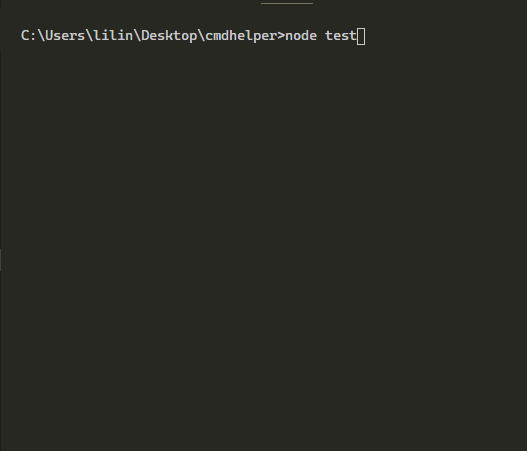
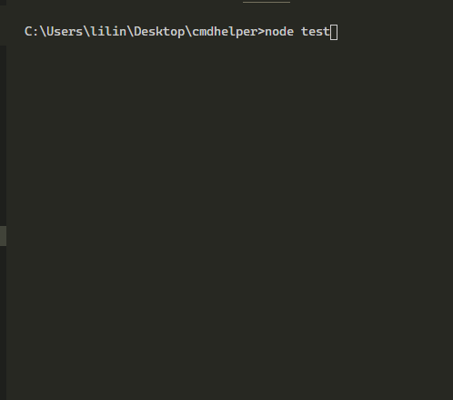
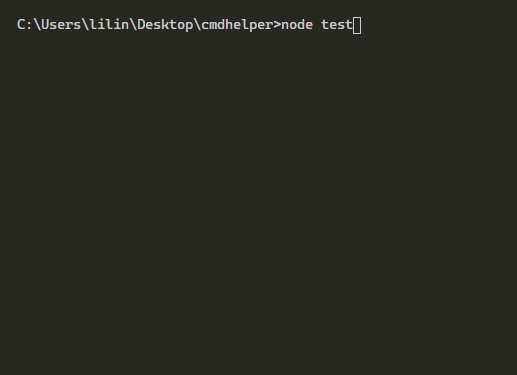

# 编写命令行程序辅助工具

见过很多库，但他们都有依赖其他包，说到底就想自己研究下底层实现原理。  
不求万金油，简单稳定能用就成。   

## 测试用例
需要事先全局安装好mocha  
运行 ```npm test``` 即可

## 使用场景示例

### 1. 打印选项获取结果
```js
const { select } = require("cmdhelper");

//promise写法
!async function () {
    const res = await select("您喜欢的歌手是那个：", [
        {label: "周杰伦"},
        {label: "林俊杰"},
        {label: "by2"},
        {label: "蔡依林"},
        {label: "王蓉"},
    ]);
    console.log("您选择的是：" + res.label);
}();

//回调写法
select("您喜欢的歌手是那个：", [
        {label: "周杰伦"},
        {label: "林俊杰"},
        {label: "by2"},
        {label: "蔡依林"},
        {label: "王蓉"},
], (err, res) =>{
    if (err) {
        console.log(err);
    } else {
        console.log("您选择的是：" + res.label);
    }
});
```
效果示例：   


### 2. 打印确定询问
```js
const { confirm } = require("cmdhelper");

//promise写法（仅支持这种写法）
!async function () {
    const is = await confirm("您确定要买这条辣条吗？", {confirmText: "确定", cancelText: "取消"});
    console.log("您选择的是：" + is);
}();
```
效果示例：   


### 3. 打印加载动画
```js
const { loading } = require("cmdhelper");

const done = loading("正在下载AV");
setTimeout(() => {
    done("您的AV下载完成");
}, 5000);
```
效果示例：   


### 4. 进度条

*正在实现中...*